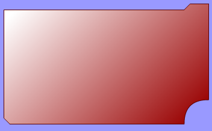
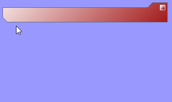

# Descripción del Proyecto

SwfdotNet es una librería que desarrollé en **C#** en el 2005 para crear dinámicamente películas swf de flash desde .NET tanto en Windows como en Linux  
  
Está programada estudiando las especificaciones del formato SWF de Macromedia, por lo que las películas generadas eran compatibles con cualquier reproductor de swf de version 5 en adelante.

**_GitHub:_** [https://github.com/enteropositivo/swf-dotnet](https://github.com/enteropositivo/swf-dotnet)[](https://github.com/enteropositivo/swf-dotnet)

## Algunos ejemplos de uso

A continuación muestro algunos ejemplos seleccionados de lo que se puede hacer con esta librería.

### Rectángulo con relleno degradado

```csharp
Rectangle Rct = new Rectangle(6000, 2000, 400);      //- ancho, alto, radio
            
Rct.LineStyle =new LineStyle(new RGB(255,153,0), 4); //-Estilo de linea (grosor 4)
            
//-Creación del gradiente, permite varios colores
Gradient G = new Gradient(GradientType.LinearGradient,-45); //-Lo haremos lineal inclinado 45º
G.AddColor(new RGB(255,255,224), 0);                        //-Primer color en posición 0
G.AddColor(new RGB(255,204,0), 255);                        //-Segundo color en posición 255
                        
Rct.FillStyle = new FillStyle(G);     //-Relleno con el gradiente creado
    
Movie movie = new Movie(6400, 2400,new RGB(153,153,255));
movie.Define(Rct);
movie.Frames[1].Add(Rct);             //-Emplazo al rectángulo en el primer fotograma 
movie.SaveToFile(@"ejemplo2.swf");    //-Genero el SWF
```

Copy


---

### Cómo incrustar imágenes

```csharp
Rectangle Rct = new Rectangle(2400,    2400, 400);
Rct.LineStyle =new LineStyle(new RGB(255,153,0), 4);
            
TagDefineBitsJPEG2 jpeg = new TagDefineBitsJPEG2("pin.jpg");   //-Defino la imagen        
                                
Rct.FillStyle = new FillStyle(jpeg, BitmapFill.ClippedBitmap); //-Lo relleno con el jpeg

Movie movie = new Movie(4000, 4000,new RGB(153,153,255));
movie.FrameRate=12;
            
movie.Define(jpeg);           //- Añadimos la imagen e la Librería de objetos de la película 
movie.Define(Rct);
    
Matrix mx = new Matrix();     //-Matriz de transformación para manipular objetos
mx.Tanslate(1400,400);        //-Traslado el objeto 
mx.Rotate(-30);               //-Lo roto -30º
            
movie.Frames[1].Add(Rct, mx); //-Lo añado y le aplico la transformacion
           
movie.SaveToFile(@"ejemplo4.swf");
```

Copy


---

### Creación de una forma vectorial personalizada

```csharp
Gradient G = new Gradient(GradientType.LinearGradient,-45);
G.AddColor(new RGB(255,255,255), 0);
G.AddColor(new RGB(153,0,0), 255);
        
LineTool shap = new LineTool(); //-Objeto de forma personalizada

//- Le añado el estilo de línea y relleno
shap.LineStyles.Add(new LineStyle(new RGB(91,0,0),0));
shap.FillStyles.Add(new FillStyle(G));
            
//- Establezco el estilo de linea y de relleno anteriores    
//  Nota: Por defecto ya vienen con un estilo por tanto asigno estilos con índice 2 en la lista de estilos
shap.SetStyle(2,2);            
            
shap.HorizontalTo(6000);    //- Horizontal 6000 Twips a la derecha
shap.LineTo(200,-200);      //- Linea hasta la posición x=200 y=-200
shap.HorizontalTo(600);     //- Una pequeña horizontal 600 Twips a la derecha
shap.VerticalTo(3200);      //- 3200 Twips hacia abajo
            
shap.CurveTo(-800,0,0,800); //- Curva indicada por 3 puntos(el último trazado y estos 2 nuevos) 
            
shap.HorizontalTo(-5800);   //-Horizontal 5800 hacia la izquierda
shap.LineTo(-200,-200);     //- una pequeñaa muesca en la esquina
shap.VerticalTo(-3600);     //- Y cerramos la forma subiendo hasta el inicio
            
Movie movie = new Movie(7200, 4600,new RGB(153,153,255));
movie.Define(shap);
            
movie.Frames[1].Add(shap);    
movie.SaveToFile(@"ejemplo5.swf");
```

Copy



---

### Botón con 3 estados diferentes (reposo, hover y click)  

```csharp
Gradient G = new Gradient(GradientType.LinearGradient,-45);
G.AddColor(new RGB(255,255,255), 0);
G.AddColor(new RGB(20,0,125), 255);
        
//- Estado del botón en reposo
Rectangle rct = new Rectangle(2000,2000,400);
rct.LineStyle =new LineStyle(new RGB(0,50,100),4);
rct.FillStyle= new FillStyle(G);        //- Relleno con el gradiente creado
            
//- Estado del botón en Hover
Rectangle rctOn = new Rectangle(2000,2000,400);
rctOn.LineStyle =new LineStyle(new RGB(238,221,34),4);
rctOn.FillStyle= new FillStyle(G);        //- Relleno con el gradiente creado
            
//- Estado del botón en Mouse Down
Rectangle rctPush = new Rectangle(2000,2000,400);
rctPush.LineStyle =new LineStyle(new RGB(238,221,34),4);
rctPush.FillStyle= new FillStyle(new RGB(238,221,34));
            
//- Creo el botón y le asigno los estados creados
TagDefineButton btn = new TagDefineButton();        
btn.Up=rct;
btn.Over=rctOn;
btn.Hit=rct;
btn.Down=rctPush;
            
Movie movie = new Movie(2400, 2400,new RGB(153,153,255));
            
movie.Define(rct);        //- Como siempre en flash, cada elemento debe definirse en la libreria
movie.Define(rctOn);
movie.Define(rctPush);
movie.Define(btn);
            
movie.Frames[1].Add(btn);    
movie.SaveToFile(@"ejemplo8.swf");

```

Copy


---

### Ventana con un botón para abrir o cerrarla

El siguiente ejemplo es muy completo ya que también programe la librería para que aceptase código de **ActionScript** y así poder crear objetos dinámicos o que respondan a eventos.  

```csharp
Movie movie = new Movie(6900, 4200,new RGB(255,255,255));
movie.FrameRate=1;

Gradient G = new Gradient(GradientType.LinearGradient,-45);
G.AddColor(new RGB(255,255,255), 0);
G.AddColor(new RGB(153,0,0), 255);
        
//- Forma de la venta cerrada 
LineTool Cerrada = new LineTool();    
Cerrada.LineStyles.Add(new LineStyle(new RGB(100,100,100),0));
Cerrada.FillStyles.Add(new FillStyle(G));

Cerrada.SetStyle(2,2);        //-Asigno los nuevos estilos añadidos    
Cerrada.HorizontalTo(6000);
Cerrada.LineTo(200,-200);
Cerrada.HorizontalTo(600);
Cerrada.VerticalTo(800);
Cerrada.HorizontalTo(-6600);
Cerrada.LineTo(-200,-200);
Cerrada.VerticalTo(-400);


LineTool Abierta = new LineTool();
Abierta.LineStyles.Add(new LineStyle(new RGB(100,100,100),0));
Abierta.FillStyles.Add(new FillStyle(G));

Abierta.SetStyle(2,2);        //-Asigno los nuevos estilos añadidos
Abierta.HorizontalTo(6000);
Abierta.LineTo(200,-200);
Abierta.HorizontalTo(600);
Abierta.VerticalTo(3200);
Abierta.CurveTo(-800,0,0,800);
Abierta.HorizontalTo(-5800);
Abierta.LineTo(-200,-200);
Abierta.VerticalTo(-3600);
    

Rectangle rct = new Rectangle(200,200,2);        //- Botón en reposo
rct.LineStyle =new LineStyle(new RGB(255,255,255),0);
rct.FillStyle= new FillStyle(G);

Rectangle rctOn = new Rectangle(200,200,2);      //- Botón Activo
rctOn.LineStyle =new LineStyle(new RGB(238,221,34),2);
rctOn.FillStyle= new FillStyle(G);

TagDefineButton boton = new TagDefineButton();
boton.Up=rct;
boton.Over=rctOn;
boton.Hit=rct;
boton.Down=rct;
        
//- Creo un nuevo movie clip que representa la Ventana
DefineSprite ventana = new DefineSprite();

ventana.Frames[1].Add(Cerrada);
ventana.Frames[1].Script.Stop();    //-Stop() en este frame para evitar un bucle
ventana.Frames[2].Remove(Cerrada);  //-En el 2º frame solo debe estar la ventana Abierta
ventana.Frames[2].Add(Abierta);

//- ActionScript ->   var open;
ventana.Frames[1].Script.Push("open");  //-Meto en la pila el nomrbre de la variable
ventana.Frames[1].Script.DefineVar();   //-Creo una variable con lo que tenga en la pila

//- ActionScript ->   open=false;
ventana.Frames[1].Script.Push("open");
ventana.Frames[1].Script.Push(0);
ventana.Frames[1].Script.SetVar();

boton.Script.TellTarget("WINDOW");    //-Llamo al simbolo por el nombre 

//- ActionScript ->   open=!open;     Para alternar x entre True y False
boton.Script.Push("open");    //-  Añado a la pila X Para cuando llame a SetVar
boton.Script.Push("open");    //-     Añado a la pila X para recoger el valor de x con GetVar  
boton.Script.GetVar();        //-  Saco de la pila x y GetVar mete su valor correspondiente
boton.Script.Not();           //-  Niego el valor que haya en la pila (el obtenido con GetVar)
boton.Script.SetVar();        //-  Y se lo asigno a la variable que hubiera en la pila (la 1ª x)

//-    ActionScript ->   if(open==true)
boton.Script.Push(1);        //-  Para comparar con Equal
boton.Script.Push("open");   //- Quiero obtener el valor de la variable x
boton.Script.GetVar();       //- Obtengo el valor
boton.Script.Equal();        //- Para usar con la instruccion IF
boton.Script.If();           //- Tengo en la pila un valor verdadero??
boton.Script.gotoAndStop(2);  //- Me muevo al frame del sprite que tenía la ventana abierta
boton.Script.Else();
boton.Script.gotoAndStop(1);  //- Cierro la ventana
boton.Script.EndIf();
    
//- Librerá de simbolos de la película    
movie.Define(Abierta);
movie.Define(Cerrada);
movie.Define(rct);
movie.Define(rctOn);
movie.Define(boton);
movie.Define(ventana);

movie.Frames[1].Add(ventana, "WINDOW");    //- Añado el Sprite y le asigno el Nombre de la Instancia
Matrix mx = new Matrix();
mx.Tanslate(6200,0);
movie.Frames[1].Add(boton,mx);             //- Añado el botón en la posición indicada por mx

movie.SaveToFile(@"ejemplo9.swf");
```

Copy



---

### Generar SWF desde ASP.NET

```csharp
<%@ Page Language="C#" %>
<%@ Register TagPrefix="SDN" Namespace="SwfdotNet" Assembly="SwfdotNet" %>
<%@ Register TagPrefix="SDNFB" Namespace="SwfdotNet.Format.BasicTypes" Assembly="SwfdotNet" %>
<%@ Register TagPrefix="SDNFS" Namespace="SwfdotNet.Format.Shapes" Assembly="SwfdotNet" %>
<%@ Register TagPrefix="SDNFT" Namespace="SwfdotNet.Format.Tags" Assembly="SwfdotNet" %>
<%@ Register TagPrefix="SDNFU" Namespace="SwfdotNet.Format.UtilTypes" Assembly="SwfdotNet" %>
<%@ Register TagPrefix="SDNS" Namespace="SwfdotNet.Shapes" Assembly="SwfdotNet" %>
<%


//    Uso de gradientes para relleno
Rectangle Rct = new Rectangle(6000,    2000, 400);

Rct.LineStyle =new LineStyle(new RGB(255,153,0), 4);

//-Creación del gradiente, permite varios colores
Gradient G = new Gradient(GradientType.LinearGradient,-45);     //-Lo haremos lineal inclinado 45º
G.AddColor(new RGB(255,255,224), 0);                            //-Primer color en posición 0
G.AddColor(new RGB(255,204,0), 255);                            //-Segundo color en posicón 255

//-Relleno con el gradiente creado
Rct.FillStyle = new FillStyle(G);         

Movie movie = new Movie(7000, 4000,new RGB(153,153,255));
movie.Define(Rct);
movie.Frames[1].Add(Rct);    

Response.Clear(); 

//- Establecemos los tipos MIME para que el navegador sepa que es un swf
Response.AddHeader( "Content-Type", "application/x-shockwave-flash");
Response.AddHeader( "Content-Disposition", "inline;filename=ejemplo7.swf");

Response.BinaryWrite(movie.GetBytes);    // <-- Lanzamos el contenido del swf al navegador !!
 

//---- Archivo ejemplo7.aspx ----\\
%>
```

